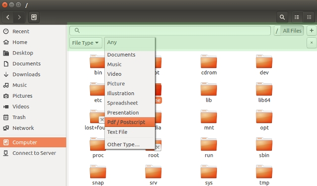

# Skipulag gagna í Linux


## Inngangur

Í Linux er upplýsingum stjórnað með skráakerfi sem byggir á skrám og möppum. Gögn eru skipulögð í möppur eftir tilgangi svo auðvelt sé að finna efni, halda utan um verkefni og taka öryggisafrit.



## Grunnhugtök

- `Skrá`: Eining sem geymir efni, til dæmis texta, mynd, hljóð eða myndband.
- `Mappa`: Geymsla sem heldur utan um skrár og aðrar möppur.
- `Slóð (path)`: Staðsetning sem segir hvar skrá eða mappa er vistuð.
- `Heimamappa (home)`: Persónuleg mappa notanda, oft táknuð sem `~`.

## Helstu möppur í Linux

- `Home` (`~`): Persónuleg gögn notanda.
- `Documents`: Verkefni, skýrslur og önnur vinnuskjöl.
- `Downloads`: Skrár sem hlaðið er niður af netinu.
- `Pictures`, `Music`, `Videos`: Miðlæg geymsla fyrir myndefni og hljóð.
- `Desktop`: Tímabundin gögn sem þarf skjótan aðgang að.

## Vinnulag við meðhöndlun gagna

1. Opnaðu **Files** (skráastjórann, t.d. Nautilus, Dolphin eða Thunar).
2. Búðu til nýja möppu fyrir hvert verkefni.
3. Færðu skrár í viðeigandi möppur með drag-and-drop.
4. Endurnefndu skrár með lýsandi heitum, til dæmis `verkefni-staerdfraedi-2026.pdf`.
5. Notaðu leit í skráastjóranum til að finna skrár.
6. Eyddu óþarfa skrám í ruslið og tæmdu ruslið þegar þú ert viss.

## Vinnulag

- Nota eina aðalmöppu fyrir hvert verkefni eða námskeið.
- Forðast að geyma varanleg gögn á `Desktop`.
- Nota samræmd og skýr heiti á skrár og möppur.
- Taka regluleg afrit á ytri disk eða í skýjaþjónustu.

### Yfirlit: vinna með gögn í Linux

- **Skráastjóri (Files):** Meginverkfæri til að skoða, færa og skipuleggja skrár.
- **Heimamappa (`~`):** Inniheldur helstu persónulegu möppur notanda.
- **Leit:** Flýtir fyrir að finna skrár eftir nafni eða hluta af nafni.
- **Draga og sleppa:** Einföld leið til að færa eða afrita skrár milli mappa.
- **Rusl (Trash):** Skrár fara fyrst í rusl áður en þeim er eytt varanlega.

### Mikilvæg hugtök

- **Permissions (heimildir):** Stjórna því hver má lesa, breyta eða keyra skrár.
- **Backup (afritun):** Regluleg afritun ver gögn gegn glötun.

## Samantekt

Gott skipulag gagna í Linux byggist á þremur atriðum: rétt flokkun í möppur, skýr heiti og regluleg afritun. Með þessu vinnulagi verður auðveldara að finna gögn, minnka líkur á ruglingi og vernda mikilvægar upplýsingar.

## Verkefnaskil í Canvas

#### Öllum verkefnum á að skila í Canvas

Dæmi: Öll gögn í verkefni 1 eru í einni möppu sem er þjöppuð í **.zip skrá**.

### Hvernig á að þjappa gögnum í eina .zip skrá? <sub></sub>

#### Leið 1: Með skráastjóra (myndrænt viðmót)

1. Opnaðu **Files** og finndu möppuna eða skrárnar sem á að skila.
2. Veldu efnið sem á að fara í `.zip`.
3. Hægrismelltu á valið efni með mús, eða smelltu neðst hægra megin á snertiflöt og veldu **Compress...** (heiti getur verið mismunandi milli Linux-umhverfa).
4. Veldu snið `zip`.
5. Veldu nafn á skránni, til dæmis `Verkefni-1.zip`, og vistaðu.

#### Leið 2: Með Terminal

1. Opnaðu **Terminal**.
2. Farðu í rétta möppu, til dæmis:

```bash
cd ~/Documents
```

3. Þjappaðu möppu í `.zip`:

```bash
zip -r Verkefni-1.zip Verkefni-1/
```

4. Eftir keyrslu verður `Verkefni-1.zip` til í sömu möppu.

### Gott að muna

- Best er að setja allt verkefnið fyrst í **eina möppu** og þjappa síðan þeirri möppu.
- Endurnefndu `.zip` skrána áður en henni er skilað, til dæmis `Nafn-Verkefni1.zip`.
- Til að afþjappa skrá í Linux má oft tvísmella á hana eða nota skipunina `unzip` í Terminal.
