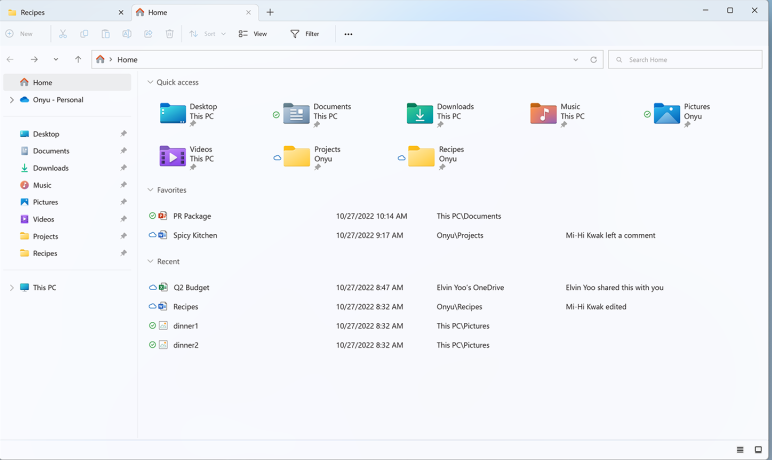

# Skipulag gagna í Windows

## Inngangur

Í Windows er upplýsingum stjórnað með skráakerfi. Skráakerfið byggir á skrám og möppum sem eru vistaðar á ákveðnum stöðum í tölvunni. Markmiðið er að halda gögnum skipulögðum, auðvelda leit og tryggja öryggi með reglulegri afritun.

## Grunnhugtök

- `Skrá`: Eining sem geymir efni, til dæmis texta, mynd, hljóð eða myndband.
- `Mappa`: Geymsla sem heldur utan um skrár og aðrar möppur.
- `Staðsetning`: Slóð sem sýnir hvar skrá eða mappa er vistuð.

## Helstu möppur í File Explorer

- `Desktop`: Tímabundin gögn sem þarf skjótan aðgang að.
- `Documents`: Verkefni, skýrslur og önnur vinnuskjöl.
- `Downloads`: Skrár sem hlaðið er niður af netinu.
- `Pictures`, `Music`, `Videos`: Miðlæg geymsla fyrir myndir, tónlist og myndbönd.
- `This PC`: Yfirsýn yfir diska, drif og helstu möppur.

## Vinnulag við meðhöndlun gagna

1. Opnaðu **File Explorer** (`Windows + E`).
2. Búðu til möppu með **New Folder** fyrir hvert verkefni eða viðfangsefni.
3. Færðu skrár í viðeigandi möppur með drag-and-drop.
4. Endurnefndu skrár með lýsandi heitum, til dæmis `verkefni-stærðfræði-2026.pdf`.
5. Notaðu leitina í efra hægra horninu í File Explorer til að finna skrár.
6. Eyddu óþarfa skrám í `Recycle Bin` og tæmdu körfuna þegar þú ert viss.

## Vinnulag

- Nota eina aðalmöppu fyrir hvert verkefni eða námskeið.
- Forðast að geyma varanleg gögn á `Desktop`.
- Nota samræmd og skýr heiti á skrár og möppur.
- Taka regluleg afrit í `OneDrive` eða á ytri disk.

### Yfirlit: vinna með gögn í Windows

- **File Explorer:** Meginverkfæri til að skoða, færa og skipuleggja skrár.
- **Notendamappa (User Folder):** Inniheldur meðal annars `Desktop`, `Documents`, `Downloads` og `Pictures`.
- **Leit:** Flýtir fyrir því að finna skrár eftir nafni eða hluta af nafni.
- **Draga og sleppa:** Einföld leið til að færa eða afrita skrár milli mappa.
- **Eyða gögnum:** Skrár fara fyrst í `Recycle Bin` og má endurheimta þær þar ef þörf er á.

### Mikilvæg hugtök

- **OneDrive:** Skýjaþjónusta Microsoft til samstillingar og afritunar gagna milli tækja.
- **Recycle Bin:** Bráðabirgðageymsla fyrir eyddar skrár áður en þeim er eytt varanlega.

## Samantekt

Gott skipulag gagna í Windows byggist á þremur atriðum: rétt flokkun í möppur, skýr heiti og regluleg afritun. Með þessu vinnulagi verður auðveldara að finna gögn, minnka líkur á ruglingi og vernda mikilvægar upplýsingar.

## Verkefnaskil í Innu

#### Öllum verkefnum á að skila í Innu

Dæmi: Öll gögn í verkefni 1 eru í einni möppu sem er þjöppuð í **.zip skrá**.

### Hvernig á að þjappa gögnum í eina .zip skrá? 

1. Opnaðu **File Explorer**.
2. Finndu möppuna eða skrárnar sem á að skila.
3. Ef um margar skrár er að ræða, veldu þær allar (`Ctrl + A` ef allt á að fara með).
4. Hægrismelltu á valið efni með mús, eða smelltu neðst hægra megin á snertiflöt.
5. Veldu **Compress to ZIP file** (eða **Send to > Compressed (zipped) folder** í eldri útgáfum af Windows).
6. Windows býr til `.zip` skrá á sama stað.

### Dæmi um niðurstöðu

- `Verkefni-1.zip`

### Gott að muna

- Best er að setja allt verkefnið fyrst í **eina möppu** og þjappa síðan þeirri möppu.
- Endurnefndu `.zip` skrána áður en henni er skilað, til dæmis `Nafn-Verkefni1.zip`.

### Windows 11

- Til að opna `.zip` skrá aftur er nóg að tvísmella; Windows afþjappar henni eða sýnir innihald hennar strax.

### Windows 10

það er ekki hægt að vinna með gögn sem eru bundin saman í .zip skrá fyrst þarf að afþjappa skrána

- Hægri smellið á `.zip` skrána og veljið **Uncompress** 
