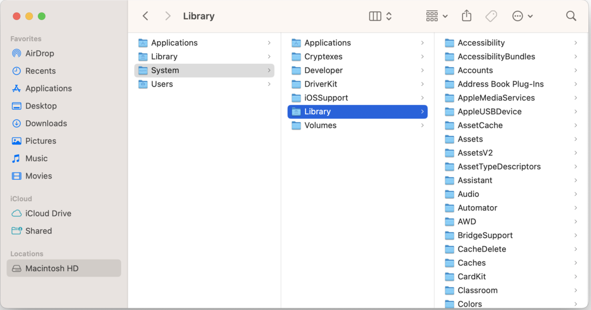

# Data Organization in macOS

## Introduction

In macOS, information is managed through a file system.

## Basic Concepts

- `File`: A unit that stores content, such as text, images, audio, or video.
- `Folder`: A container that holds files and other folders.
- `Location`: The path that shows where a file or folder is saved.

## Main Folders in Finder 

- `Desktop`: Temporary data that needs quick access.
- `Documents`: Projects, reports, and other work documents.
- `Downloads`: Files downloaded from the internet.
- `Pictures`, `Music`, `Movies`: Media storage folders.
- `Applications`: Installed programs on the computer.

## Workflow for Handling Data

1. Open **Finder** to browse files and folders.
2. Create a folder with **New Folder** for each topic or project.
3. Move files into the correct folder with drag-and-drop.
4. Rename files with descriptive names, for example `project-math-2026.pdf`.
5. Use Finder search or Spotlight (`Command + Space`) to find files.
6. Delete unnecessary files in **Trash** and empty Trash when you are sure.

## Best Practices

- Use one main folder per project or course.
- Avoid storing permanent files on `Desktop`.
- Use clear and consistent names for files and folders.
- Back up regularly with `iCloud Drive` or `Time Machine`.

### Overview: Working with Data on Mac

- **Finder:** Main tool for browsing, moving, and organizing files.
- **User folder (Home Folder):** Includes shortcuts to `Desktop`, `Documents`, `Downloads`, and `Pictures`.
- **Desktop:** Good for temporary files; keep long-term files in folders.
- **Folders and structure:** Create folders with `New Folder` (right-click or two-finger click on touchpad).
- **Search (Spotlight):** Press `Command + Space` to quickly find files and apps.
- **Drag-and-drop:** Move or copy files between folders or sidebar locations.
- **Delete data:** Move files to `Trash` or use `Command + Backspace`.

### Important Terms

- **iCloud Drive:** Cloud storage that syncs files across Mac, iPhone, and iPad.
- **Time Machine:** Built-in backup system for recovery and version history.

## Summary

Good data organization in macOS depends on proper folder structure, clear naming, and regular backups.

## Submitting Assignments in Inna

#### All assignments must be submitted in Inna.

Example: All files for Assignment 1 are placed in one folder and compressed into a **.zip file**.

### How to Compress Data into One `.zip` File

1. Open **Finder**.
2. Locate the folder or files you want to submit.
3. If there are multiple files, select them all (`Command + A` if needed).
4. Right-click (or two-finger click on the touchpad).
5. Select the appropriate option:
- **Compress "folder name"** if one item is selected.
- **Compress X Items** if multiple items are selected.
6. macOS creates a `.zip` file in the same location.

### Submission Example

- `Assignment-1.zip`

### Good to Remember

- Put all assignment files in **one folder** before compressing.
- Rename the `.zip` file clearly before submission, for example `Name-Assignment1.zip`.
- To open a `.zip` file, just double-click it.
