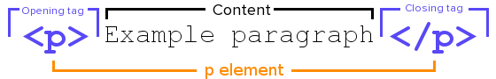
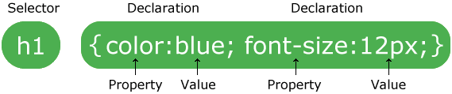

# Installation of an HTML website

Example:

```HTML

<!DOCTYPE html><!-- The latest version of HTML. 
<html lang="is">
<head>
    <meta charset="UTF-8">
    <meta http-equiv="X-UA-Compatible" content="IE=edge">
    <meta name="viewport" content="width=device-width, initial-scale=1.0">
    <title>Document</title>
</head>
<body>
<!-- Here comes content that appears in a browser -->
</body>
</html>

``` 

Remember that the following must always be present in an HTML document:

- **\<!DOCTYPE HTML\>** specifies which version of the HTML standard the browser
To use, this is the HTML 5 definition.
- **\<html commands\>** must always close with **\</\...\>**
- HTML document should end with **\</body\>\</html\>**
- Some methods are not included with the / extension: **\<meta\>, \,\<br\>, \<hr\> and \<input\>**
- Save the document with the extension **.html** to be able to open it in
    vafra (browser).
- It is **not desirable to have Icelandic letters** in the name of the document or to have **spaces** in the name.

* 
* [See more coverage](HTML-CSS/README.md)
________________________________________________________

# CSS styling

The basic grammar of CSS consists of a selector (selector) and a style (declaration). 

The selector (Selector) comes first, then comes a curly brace { Next is a command (Declaration), which is again divided into a property (property) and a value (value) which are separated by a colon : and finally a back curly brace }

> To make curly braces: { = Alt Gr key + 7 and } = Alt Gr key + 0



The valtag (_selector_) points to the HTML element (_element_) you want to style.

Hver skipun inniheldur eigindi og gildi.

A selection contains one or more commands separated by semicolons.

Many CSS commands are separated by semicolons and enclosed in curly braces.

Example:

```CSS

header h1 {
    color: #fff;
    line-height: 1.2;
    font-weight: normal;
}

```

#### Style associated with an HTML website

```HTML
<!--link is in the head tag -->
    <link rel="stylesheet" type="text/css" href="styles.css">

```

### Bjargir

* [HTML, see more details](HTML-CSS/README.md)
* [CSS, see more coverage] (HTML-CSS/stylesheet.md)

### Lesefni

* [Web programming book, chapter 3](https://bok.vefforritun.is/03.html)
* [Web programming book, chapter 4](https://bok.vefforritun.is/04.element)
