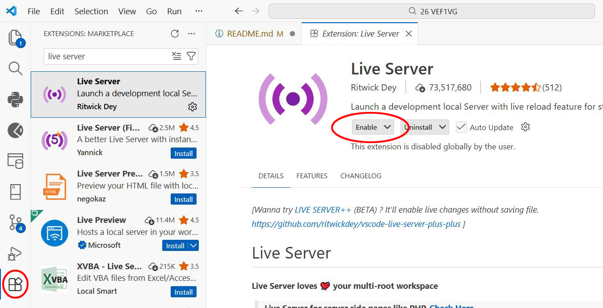
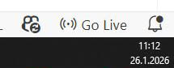
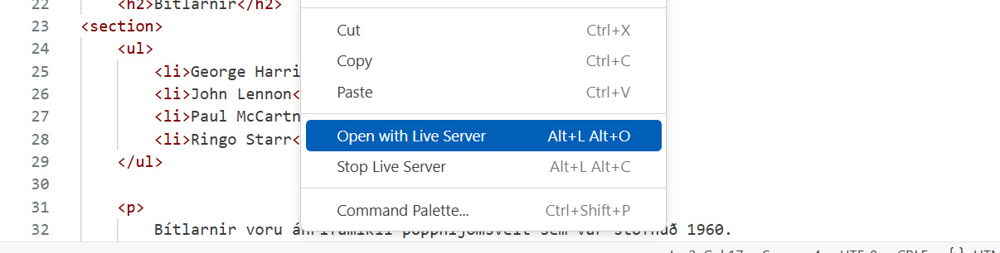

# HTML and CSS

> All course assignments are completed on your own laptop.

### Learning goals

Students can:

- set up a web development workspace in Visual Studio Code
- create an HTML5 page
- install the _Live Server_ extension and preview a site in the browser on _localhost_
- use HTML tags to structure and improve text readability
- apply CSS styles to design layout and typography

---

### Install required software

1. Download and install [Visual Studio Code](https://code.visualstudio.com/).

---

### 1.1 Create your web development workspace

1. Create a project folder on your computer.
   Do not use Icelandic letters or spaces in file/folder names.
2. Open Visual Studio Code and select `File -> Open Folder`.
   
3. Inside VS Code, create a folder named **verkefni-1**.
   
4. In **verkefni-1**, create an HTML file named **index.html** (`File -> New File`).

```text
VEF1VG
|_ verkefni-1
   |_ index.html
```

### View website in browser (localhost)

Use the Live Server extension to preview your website locally.

1. Open **Extensions** in the left sidebar and search for **live server**.
2. Install **Live Server** by Ritwick Dey.
   
3. Click **Go Live** in the lower-right corner of VS Code.
   
4. You can also right-click an HTML file and choose **Open with Live Server**.
   

### 1.2 HTML

VS Code supports many languages, including HTML.

1. In an empty `index.html`, type `!` and press Enter to generate HTML boilerplate.


2. Use the text in [Namsefni-1](Namsefni-1/verkefni-1-texti.md) as page content.
3. Wrap text with appropriate HTML tags.
4. Use indentation (Tab key) to keep your code readable.

```html
<h1> to <h6>, <p>, <em>, <strong>, <sub>, <sup>, <ul>, <ol>, <li>, <pre>, <br>, <hr>, <blockquote>, <span>
```

- [View example](Namsefni-1/Synidaemi/README.md)

### 1.3 CSS

Create a style sheet (_Cascading Style Sheets_) and link it in your HTML `<head>`.

```css
color:;
text-decoration:;
font-family:;
font-style:;
font-weight:;
border:;
margin:;
padding:;
```

Use link pseudo-classes in this order:

```css
a:link { property: value; }
a:visited { property: value; }
a:hover { property: value; }
a:active { property: value; }
```

### Assessment (5% of total grade)

#### Practice assignment

- 1.1 HTML
- 1.2 CSS

### Submission

- Put the project in a **.zip** file and submit it in Inna under Assignment 1.

#### The grade will be published in Inna.

