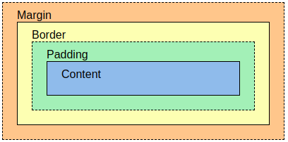

# Box model



Excerpt:

- Content - The contents of the box, where text and images appear
- Padding - Empty area around content. 
- Border - Rammi utanum bil og innihald
- Margin - Space outside the frame, the space is transparent

## Block-level Elements

A block unit always starts on the nearest line and takes up all available width (100% width).

```HTML
<h1> - <h6> | <p> | <header>| <main> | <aside> | <article>  | <footer> | <form> | <section> | <div>
```

## Inline Elements

**<span>** falls eg. 

```HTML

<span> | <a> |  

```

## Display attribute

```CSS

.daemi1 {display: none;}
.daemi2 {display: inline;}
.daemi3 {display: block;}
.daemi4 {display: inline-block;}

```

**display: none;** is commonly used with JavaScript to hide and show an object without deleting it and recreating it.

The **<head> and <script>** tags default to "display: none;"

Bjargir: 
* https://www.w3schools.com/css/css_boxmodel.asp
* https://www.w3schools.com/cssref/pr_class_display.asp

### Float

* https://www.w3schools.com/cssref/pr_class_float.php

### Flexbox

* https://www.w3schools.com/css/css3_flexbox.asp


#### Values ​​are loaded by attribute

```CSS

div {
	margin: 10px 20px 30px 40px; 
	   /*-top(1) -right(2) -bottom(3) -left(4) 
with both margin and padding */
	
	padding: 10px 20px; 
		/*top+bottom og left+right 
with both margin and padding */
	
	border: 5px solid #f0f; 
	        /*-weight, -style, -color */
/* 7 values ​​are in border-style: solid, dotted, dashed, double, ridge, inset, outset,*/
/*note! 
}

```

#### Yfirlit

* [Project solution 2](../)
* [Tenglar (links)](tenglar.md)

#### Lesefni

* [Web programming book, Box model, chapter 11](https://bok.vefforritun.is/11.css-box-model)
* [Web programming book, chapter 4](https://bok.vefforritun.is/04.element)
