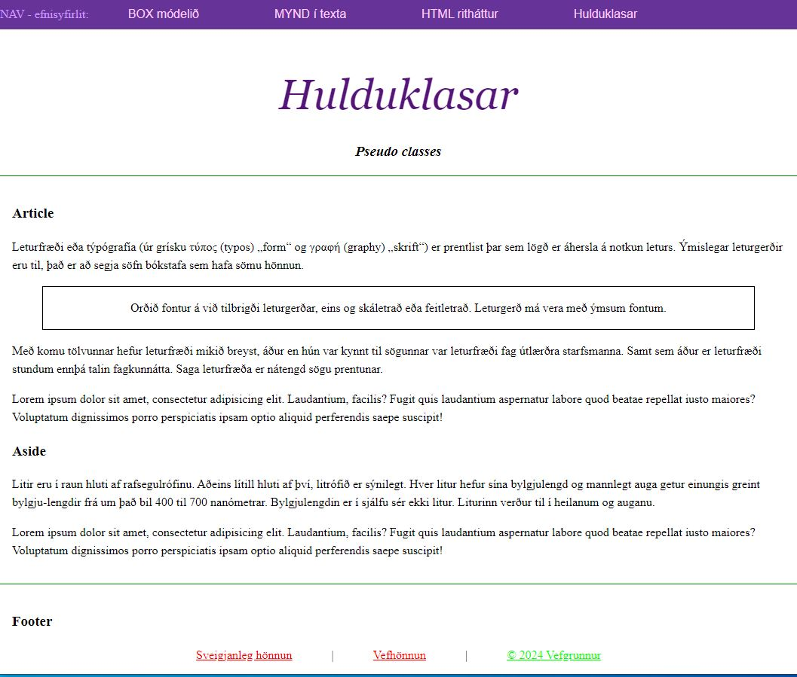

# Links to the website (_e. links_).

HTML - also in most cases can have extensions that can be used to increase the search even better
Theirs and give them more opportunities. 
In Icelandic could be interpreted as an adjective. 

To connect to other websites, we need to prepare a so-called link. 
with the following methods:

```HTML
<a href="https://www.tskoli.is"> Technical school </a>
```

It is best to break this down into the following units:

**a** is a command. 

---

### Hulduklasar  _Pseudo-classes_

```CSS
    /* unvisited link */
    a:link {
        color: #FF0000;
    }

    /* visited link */
    a:visited {
        color: #00FF00;
    }

    /* mouse over link */
    a:hover {
        color: #FF00FF;
    }

    /* selected link */
    a:active {
        color: #0000FF;
    }
```

[See more at w3schools](https://www.w3schools.com/css/css_pseudo_classes.asp)


---



#### Yfirlit

* [Project solution 2](../)
* [Box model](README.md)

#### Lesefni

* https://bok.vefforritun.is/04.element#4.6.1
