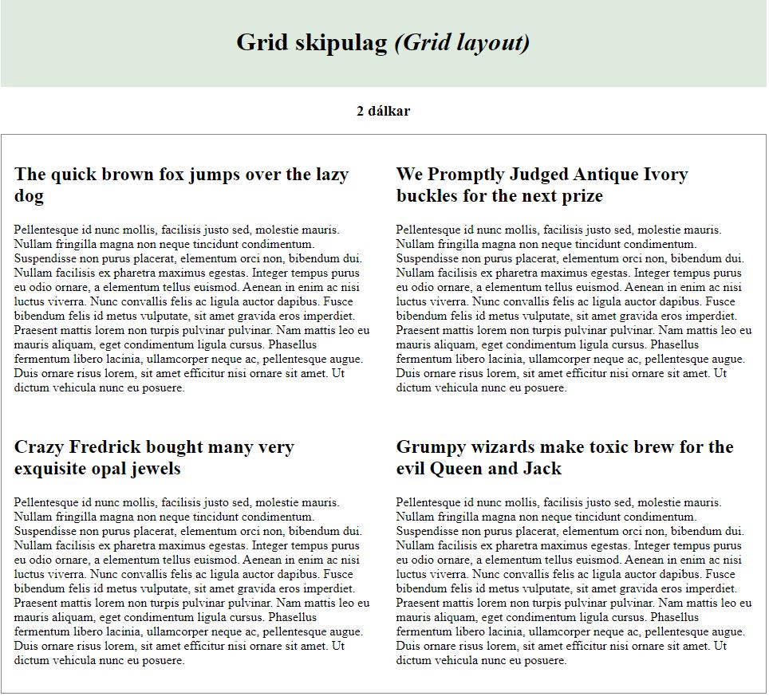
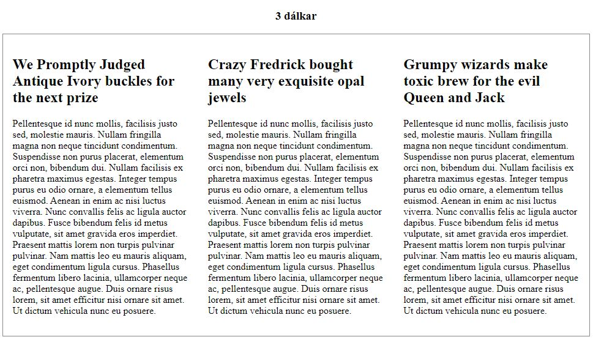
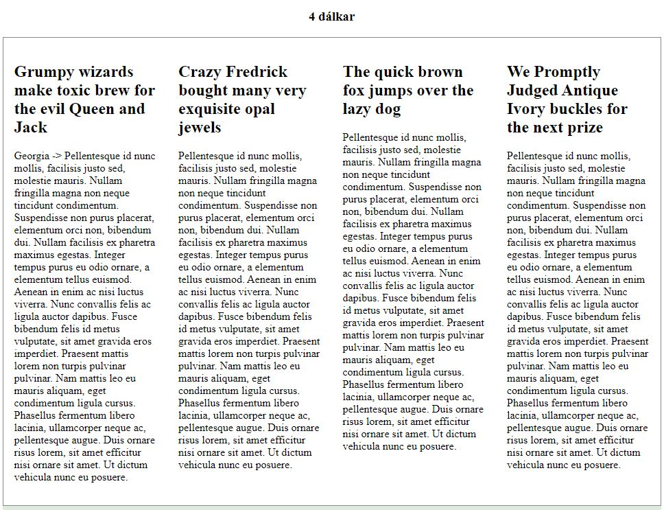

# Grid columns

---

### Pangrams

- "The quick brown fox jumps over lazy dog" (32 letters)
- "Waltz, bad nymph, for quick jigs vex." (28 letters)
- "Glib jocks quiz nymph to vex dwarf." (28 letters)
- "Sphinx of black quartz, judge my vow." (29 letters)
- "How quickly daft jumping zebras vex!" (30 letters)
- "The five boxing wizards jump quickly." (31 letters)
- "Jackdaws love my big sphinx of quartz." (31 letters)
- "Pack my box with five dozen liquor jugs." (32 letters)
- "If I come here, we both want to eat and eat."
- "There's a girl playing a box or a military song over Christmas in Qoscow."
