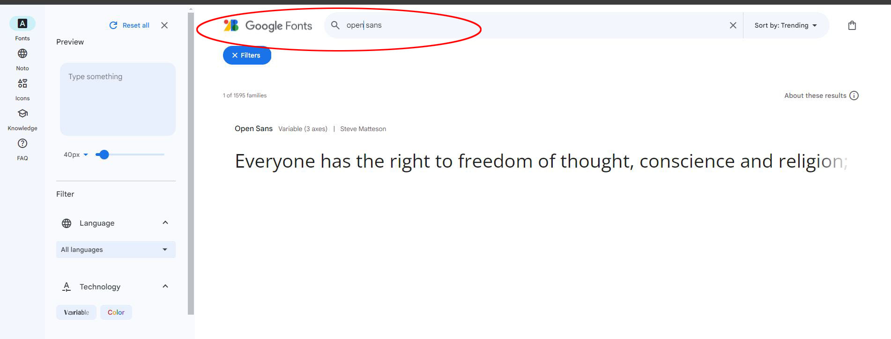
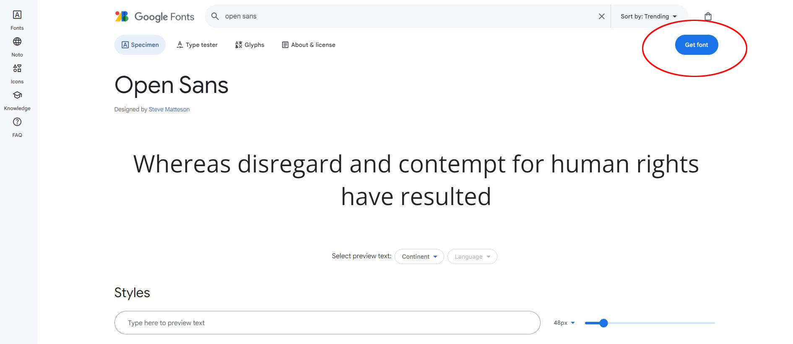
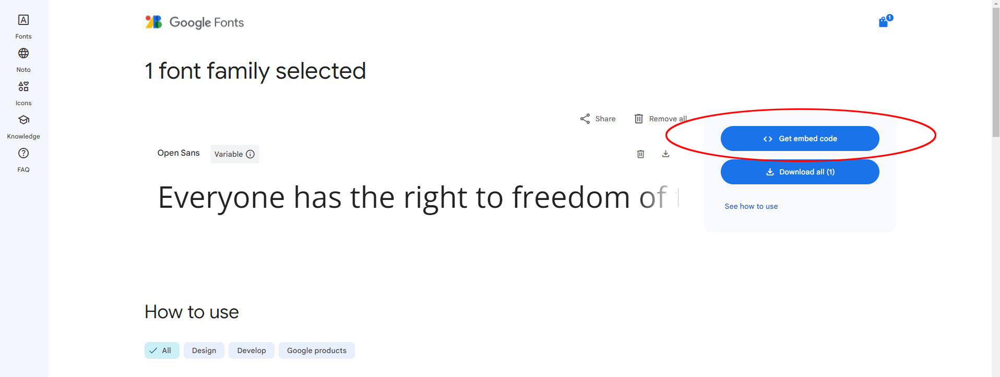
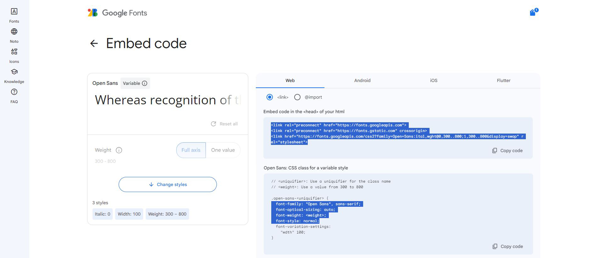
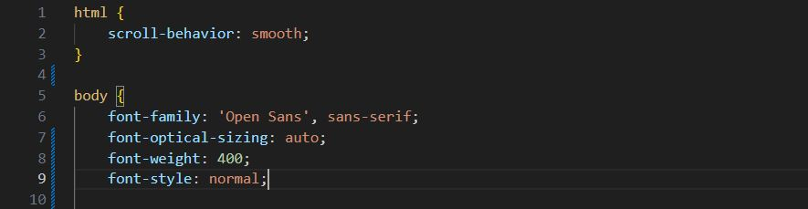

# Font downloaded from fonts.google.com

1. Select the font you want to use
    - 
1. Click on **"Get font"**
    - 
1. Click on **"Get embed code"**
    - 
1. Copy the code in **HTML head** and **CSS**
    - 
1. Fonts in CSS
    - 
