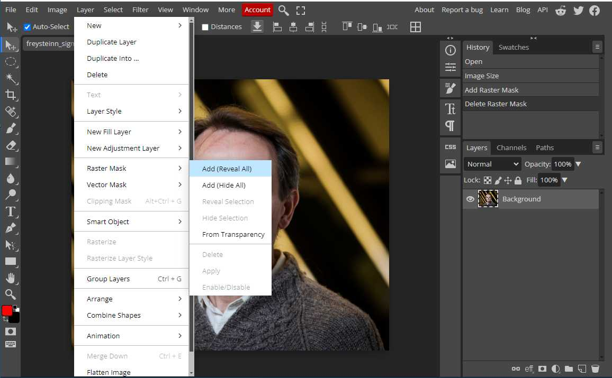
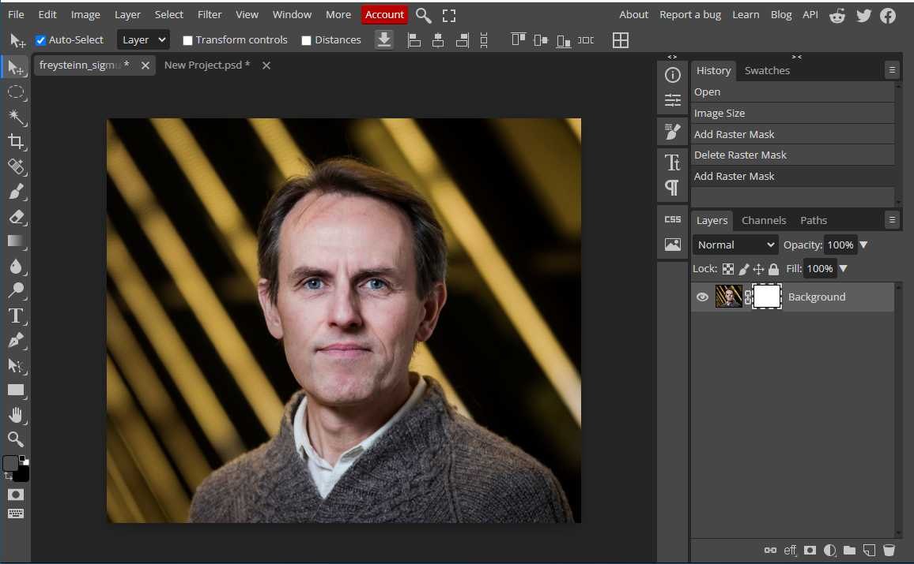
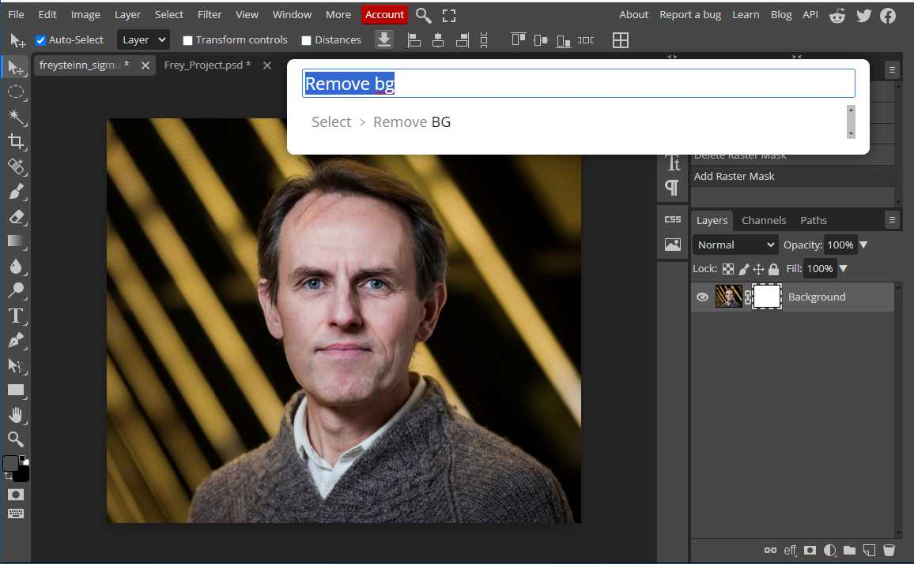
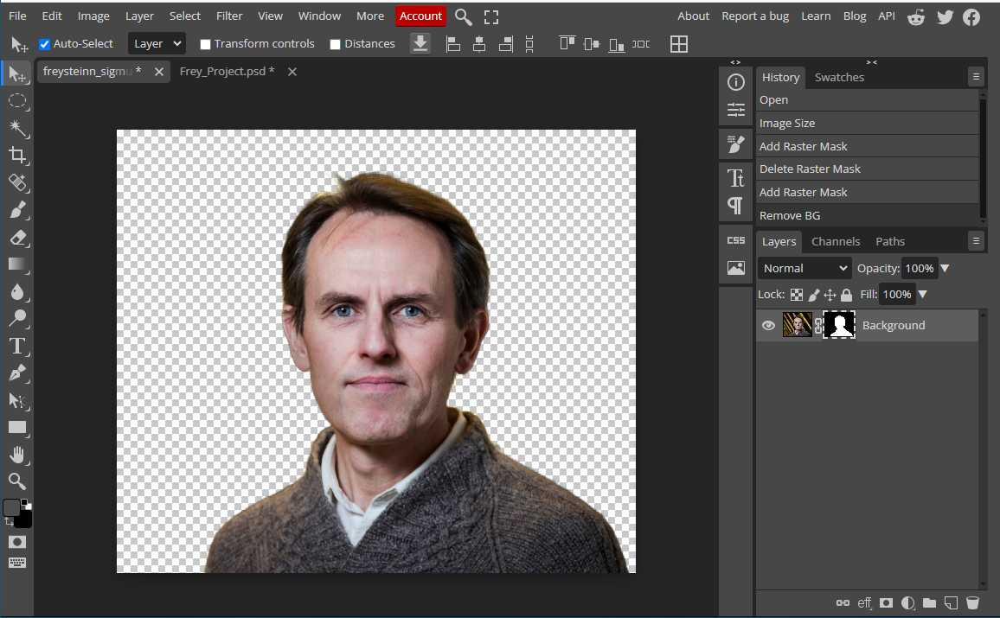

# Myndvinnsla

### Background taken from a photo

1. Create a _"Raster Mask"_
* selection menu -> _"Raster Mask"_ -> _"Add (Reveal all)"_  
    
* hit the keyboard `Control` + `f`  
    
* Type _"Remove"_ in the input field and select _"Remove BG"_  
    
* This program clears the background
    
2. Then save the image as a .png file
* Selection -> _"File"_ -> _"Export as"_ -> **.png**

### Background shade

To highlight the character from the background, the background can be covered in the following ways

1. Image opened in Photopea
* select _Lasso_ in the toolbar
* set _Feather_ to 30px in selection bar
* pulled Lasso out of Benedikt
* 
1. Choose _Select_ in the palette and then **_Inverse_**
* 
1. Select _Image_ in the palette then > _Adjustment_ > **_Curves_**
* 
1. Click in the middle of the line in the Curves image and drag it down as shown in the image and then OK
* 
1. Select the _Crop_ tool in the toolbar and cut the image as shown in the image and then click on **V** in the selection bar
* 
1. Save the image > **_File > Export as > JPG_**
* 
1. Image width to be 600px >
* 
