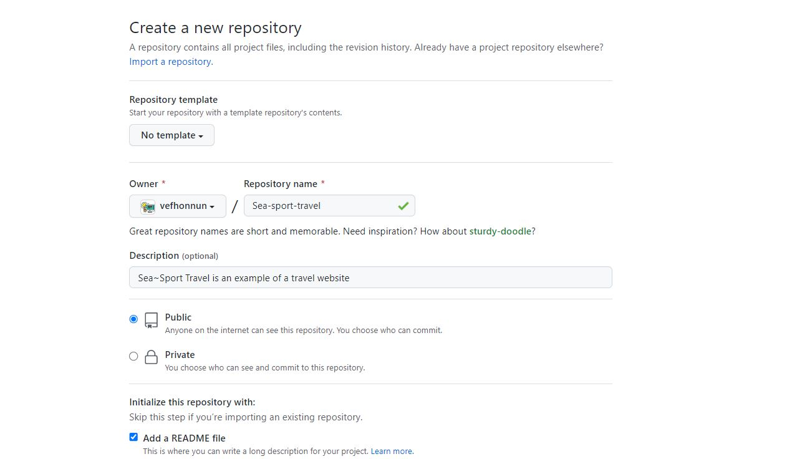
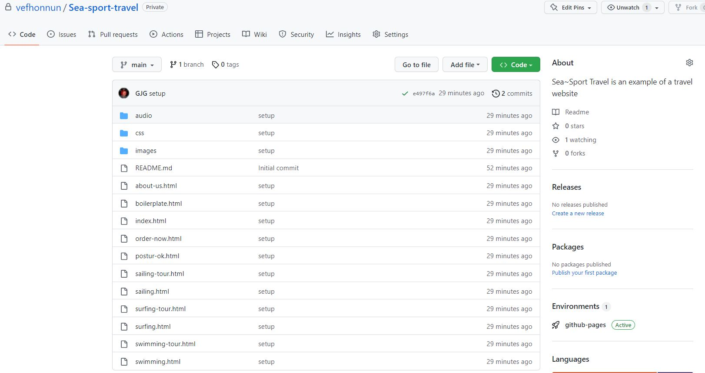
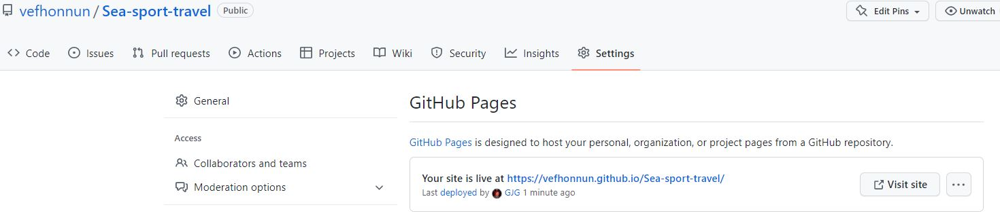

# Installation of website at (user).github.io

Github offers its customers to create a website connected to their account. 

example:
1. Username (_Username_) on Gitub account: **User**
1.	heiti geymslu (_Repository_): **notandi.github.io**
1. In the user.github.io repository -> menu -> **Settings** -> **Pages**, where you select `Branch': **_Main_**.
1. Github provides a connection between the repository and the web host at github.io
1. Now she can publish her projects on her own website.

---

## Subdomain (_Subdomain_)

If we want to create a subdomain (_subdomain_) that has a different structure and appearance than the one at _notandi.github.io_, it is a relatively simple matter.

#### Example

1. Create a repository and name it the name of the project you want to publish
    * 
* The name of the repository must **not** contain Icelandic letters or spaces in the name
1. Access the repository `$ git clone ` and put the web you want to publish to the repository.
1. Update the repository on Github.com `$ git push `
    * 
1. At the top of the repository on Github.com is a selection bar, select _Settings_ and then _Pages_ from the sidebar
    * 
1. Here you can select the repository that is rooted in a subdomain
1. After a while (2-3 minutes) it can refresh (_refresh_) the Settings folder
    * 
1. click on the link and browse the web
    * 

#### [Subdomain example](https://vefhonnun.github.io/sea-sport-travel/)
