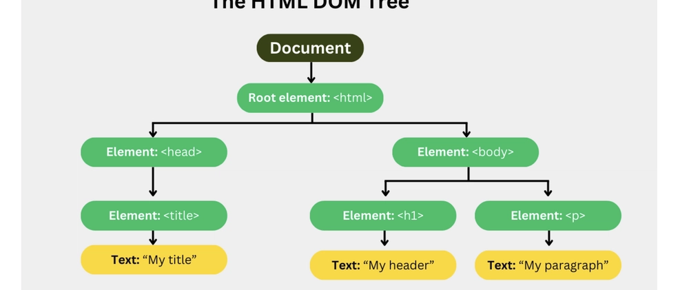

# Uppbygging vefsíðu, DOM _(Document Object Model)_

**Uppbygging vefsíðu, DOM _(Document Object Model)_** er hvernig vafrinn túlkar og skipuleggur innihald HTML-skjalsins sem **ættartré**. Þetta líkan er undirstaðan fyrir því hvernig vefsíður eru birtar og hvernig hægt er að eiga við þær með forritun.

Hér eru helstu atriðin um hvernig þessi uppbygging virkar í vafranum:

*   **Stigveldi eininga (Nodes):** Vafrinn breytir hverju HTML tagi í „hnút“ (_node_) í trénu. Efst er skjalið sjálft, og undir því raðast einingarnar eftir því hvernig þær eru hreiðraðar (_nested_) í kóðanum. Þetta þýðir að tög eins og `<body>` innihalda önnur tög eins og fyrirsagnir (`<h1>`-`<h6>`), málsgreinar (`
`) og lista (`<ul>`, `<ol>`) í rökréttu stigveldi.
*   **Gagnvirkt viðmót (API):** DOM virkar sem forritunarviðmót (**HTML DOM API**) sem gerir **JavaScript** kleift að eiga samskipti við síðuna. Með því að nota DOM getur JavaScript breytt strúktúrnum, stílum eða innihaldi síðunnar í rauntíma, til dæmis þegar smellt er á hnappa eða texti er skráður í innsláttarform.
*   **Skoðun í vafra (Inspector):** Þú getur skoðað DOM-uppbygginguna beint í hvaða nútíma vafra sem er með því að nota **Inspector/Element gluggann**. Þar má sjá nákvæmlega hvernig vafrinn hefur túlkað HTML kóðann og hvernig CSS stílar eins og **Box-módelið** (padding, border, margin) hafa áhrif á hverja einingu.

Í stuttu máli er HTML kóðinn sjálfur teikningin að síðunni, en DOM er **lifandi útfærsla vafrans á þeirri teikningu**, sem gerir vefsíðuna gagnvirka og sýnilega notandanum.

*   **Rótin og stofninn:** Efst í trénu er skjalið sjálft, en út frá því vaxa meginhlutar vefsins. Í nútíma vefhönnun er lögð áhersla á að nota **merkingarfræðileg HTML5 tög** til að búa til rökrétta greinaskipan. 
*   **Foreldra- og afkvæmaeiningar (Parent/Child):** Skipulagið byggist á því að einingar eru „hreiðraðar“ hver inn í aðra. Sem dæmi:
    *   **`<main>`** eða **`<section>`** virka sem „foreldrar“.
    *   Innan í þeim geta verið „afkvæmi“ eins og **`<article>`**, **`<h1>`** til **`<h6>`**, eða **`
`**.
    *   Listar eins og **`<ul>`** eða **`<ol>`** eru foreldrar fyrir **`<li>`** einingar, sem eru þá systkini innan trjámyndarinnar.
*   **Greinar ættartrésins:** Heimildirnar nefna sérstaklega mikilvægi þess að nota rétt tög til að skilgreina greinar trésins, svo sem:
    *   **`<header>`** og **`<nav>`** fyrir efsta hluta og valmyndir.
    *   **`<main>`** fyrir innihald.
    *   **`<article>`** fyrir efnisgreinar.
    *   **`<aside>`** fyrir hliðarefni.
    *   **`<footer>`** fyrir neðanmálsefni.

**Hvar má finna ítarlegri upplýsingar?**
Fyrir þá sem vilja dýpka skilning sinn á því hvernig á að skrifa og skipuleggja þessa tráskipan, þá vísa heimildirnar í:
1.  **Bókina um vefforritun:** Sérstaklega [**kafla 4 (HTML Element)**](https://bok.vefforritun.is/04.element) og **kafla 7 (Að skrifa HTML)**.
2.  **MDN kennsluefnið:** Kaflann um [**„Structuring content with HTML“**](https://developer.mozilla.org/en-US/docs/Learn_web_development/Core/Structuring_content) sem fer ítarlega í hvernig á að byggja upp strúktúrinn.
3.  [**HTML DOM API:**](https://developer.mozilla.org/en-US/docs/Web/API/HTML_DOM_API) Ítarlegar tæknilegar tilvísanir um hvernig forritunarviðmótið heldur utan um þessa tráskipan.

Þessi uppbygging er undirstaðan í því að **vafrinn skilji samhengið** á síðunni og geti birt hana rétt, auk þess sem hún er lykilatriði fyrir **aðgengi** (_accessibility_) svo hjálpartæki eins og skjálesarar geti ratað um „ættartréð“.
