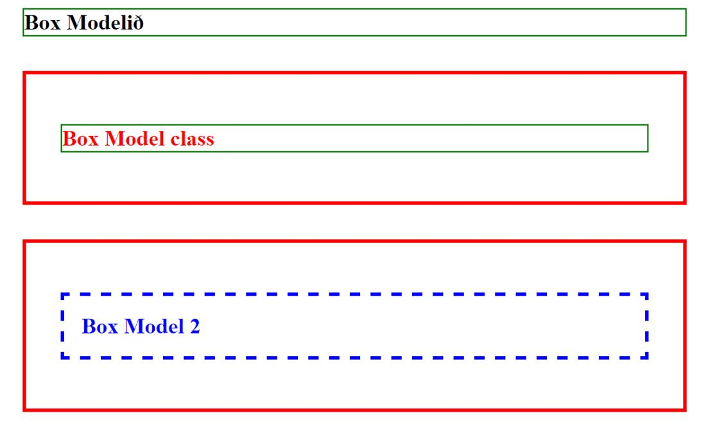
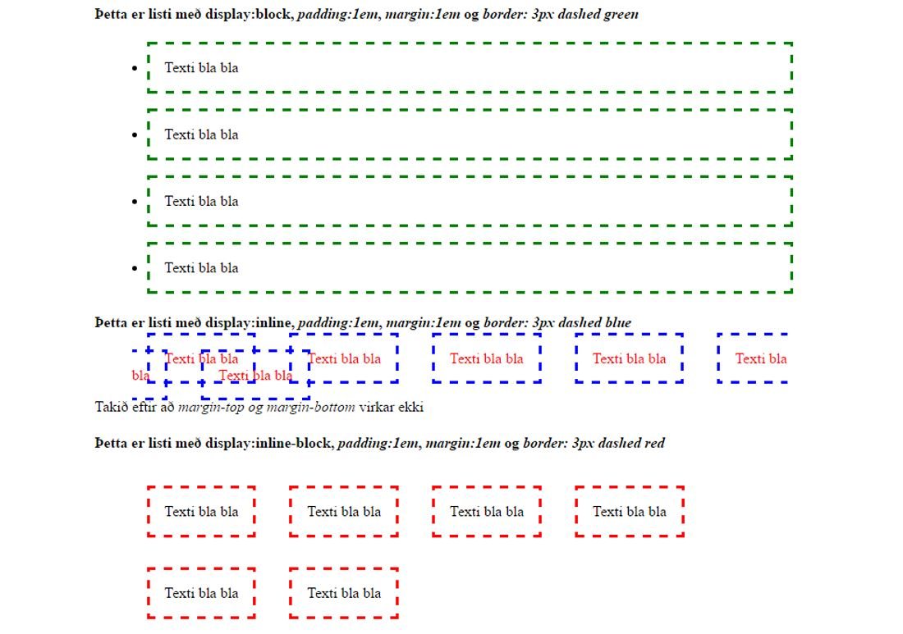
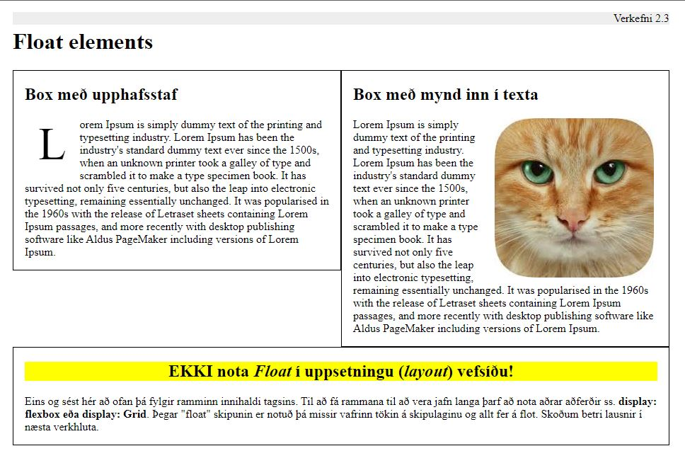
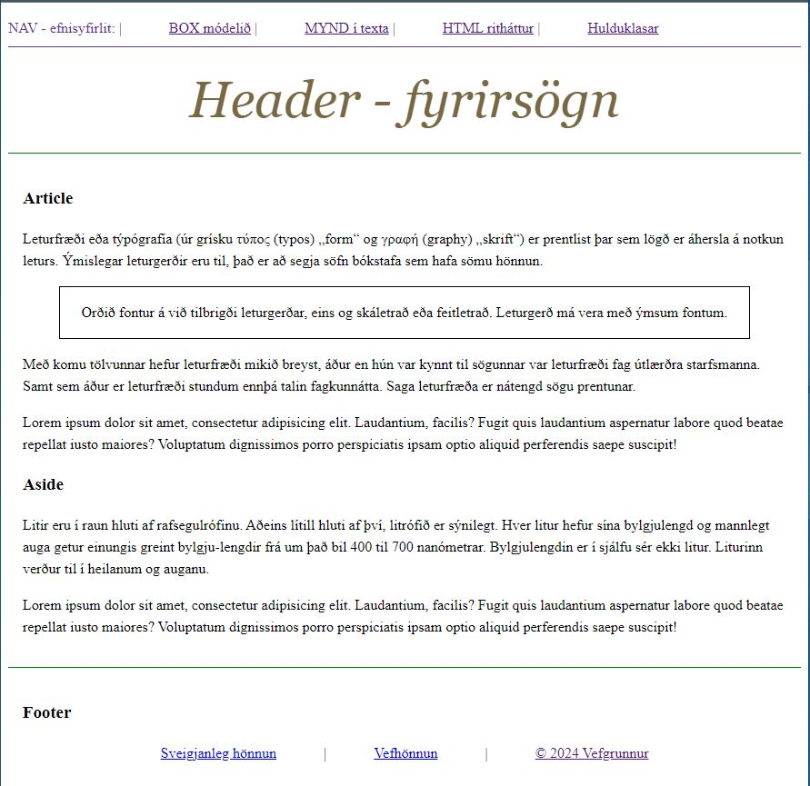

# Uppbygging vefsíðu í vafra

### Markmið:

Nemendur geta:

- skilið hvernig box módelið virkar í vafra
- breytt eiginleikum taga með _display:_ 
- sett mynd með texta, _float_
- ritað vefsíður í HTML5 rithætti (_HTML5 Semantics_)
- stílað leyniklasa (_pseudo classes_) á tög 

---

**Uppbygging vefsíðu, DOM _(Document Object Model)_** er hvernig vafrinn túlkar og skipuleggur innihald HTML-skjalsins sem [**ættartré**](Námsefni/DOM.md). Þetta líkan er undirstaðan fyrir því hvernig vefsíður eru birtar og hvernig hægt er að eiga við þær með forritun.

Hér eru helstu atriðin um hvernig þessi uppbygging virkar í vafranum:

*   **Stigveldi eininga (Nodes):** Vafrinn breytir hverju HTML tagi í „hnút“ (node) í trénu. Efst er skjalið sjálft, og undir því raðast einingarnar eftir því hvernig þær eru hreiðraðar (nested) í kóðanum. Þetta þýðir að tög eins og `<body>` innihalda önnur tög eins og fyrirsagnir (`<h1>`-`<h6>`), málsgreinar (`<p>`) og lista (`<ul>`, `<ol>`) í rökréttu stigveldi.
*   **Gagnvirkt viðmót (API):** DOM virkar sem forritunarviðmót (**HTML DOM API**) sem gerir **JavaScript** kleift að eiga samskipti við síðuna. Með því að nota DOM getur JavaScript breytt strúktúrnum, stílum eða innihaldi síðunnar í rauntíma, til dæmis þegar smellt er á hnappa eða gögn slegin inn í eyðublöð.
*   **Skoðun í vafra (Inspector):** Þú getur skoðað DOM-uppbygginguna beint í hvaða nútíma vafra sem er með því að nota **Inspector/Element gluggann**. Þar má sjá nákvæmlega hvernig vafrinn hefur túlkað HTML kóðann og hvernig CSS stílar eins og **Box-módelið** (padding, border, margin) hafa áhrif á hverja einingu.

Í stuttu máli er HTML kóðinn sjálfur teikningin að síðunni, en DOM er **lifandi útfærsla vafrans á þeirri teikningu**, sem gerir vefsíðuna gagnvirka og sýnilega notandanum.
  
### 2.1 Box módelið

Búðu til HTML síðu og skrifaðu 3 línur af texta og settu þær í fyrirsagnarletur &lt;H1>. Stílaðu textann eins og sýnt er hér á myndinni



> H1 - padding - border - margin

### 2.2 Eiginleikar taga (_Display settings_).

Undir fyrirsagnirnar settu línu &lt;HR> og búðu til lista &lt;UL> í html síðu og breyttu eiginleikum listans með CSS "display" skipuninni eins og sýnt er hér á myndinni.
   



### 2.2 CSS "_Float_" 

Búðu til vefsíðu inniheldur „dummy“ texta sem þú átt að fjölfalda og raða upp eins og sýnt er hér á myndinni.



Eigindi sem m.a. eru notuð í stílsíðu eru `float:left, border og padding `

---

### 2.4 HTML5 ritháttur.  

Búðu til vefsíðu og settu viðeigandi HTML5 tög í vefsíðuna

```HTML
<header> <nav> <section> <main> <article> <aside> <footer> 
```



- Notaðu **HTML 5** rithátt til að byggja vefsíðuna upp með réttum hætti
- [HTML Semantic Elements](https://www.w3schools.com/html/html5_semantic_elements.asp) 

---

### 2.5 Leyniklasar _Pseudo classes_ 
 
Setjið tengla (_links_) í NAV tagið efst í vefsíðunni sem þú varst að búa til. Tenglarnir eiga að vísa á verkefni 2.1-2 og verkefni 2.3 HTML síðurnar. Bætið síðan hulduklösum í ` nav a ` skipunina í stílsíðuna. 

```CSS
  a:link, a:visited, a:hover, a:active 

```
<!-- canvas 
### Námsmat 5% af heildareinkunn

- 2.1 Box módelið 
- 2.2 "_display_" stillingar  
- 2.3 Display: float
- 2.4 HTML5 ritháttur
- 2.5 Hulduklasar _Pseudo classes_

### Verkefnaskil

- Setjið öll gögn verkefnisins í **.zip skrá** og skilið í verkefni 2 í Innu

#### Einkunn verður birt í Innu
-->
