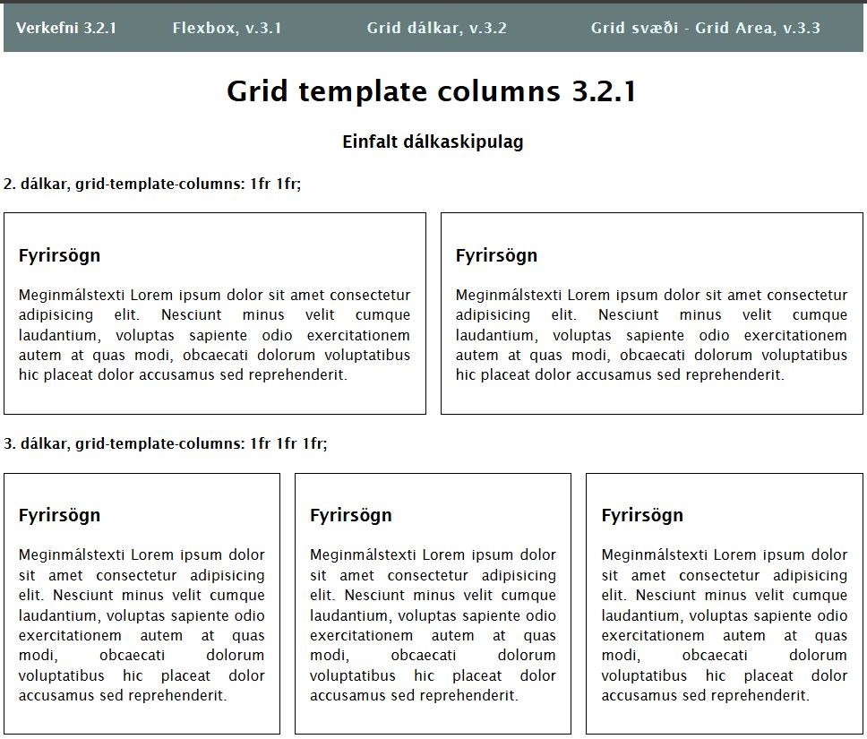
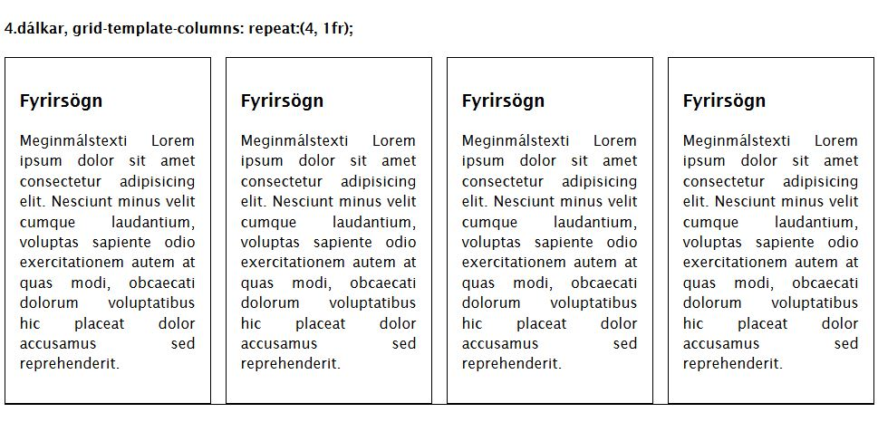
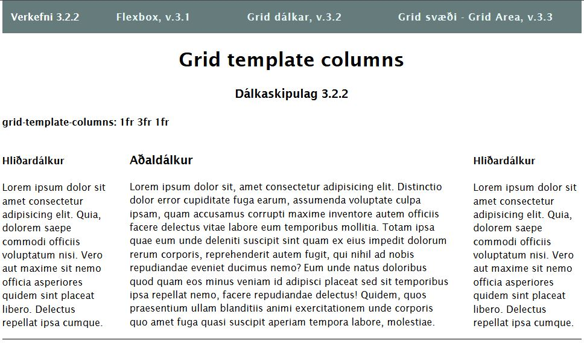
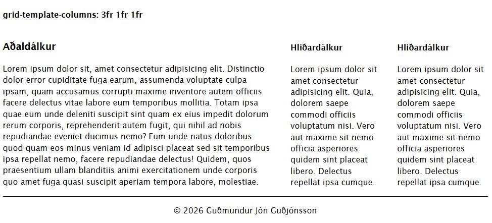
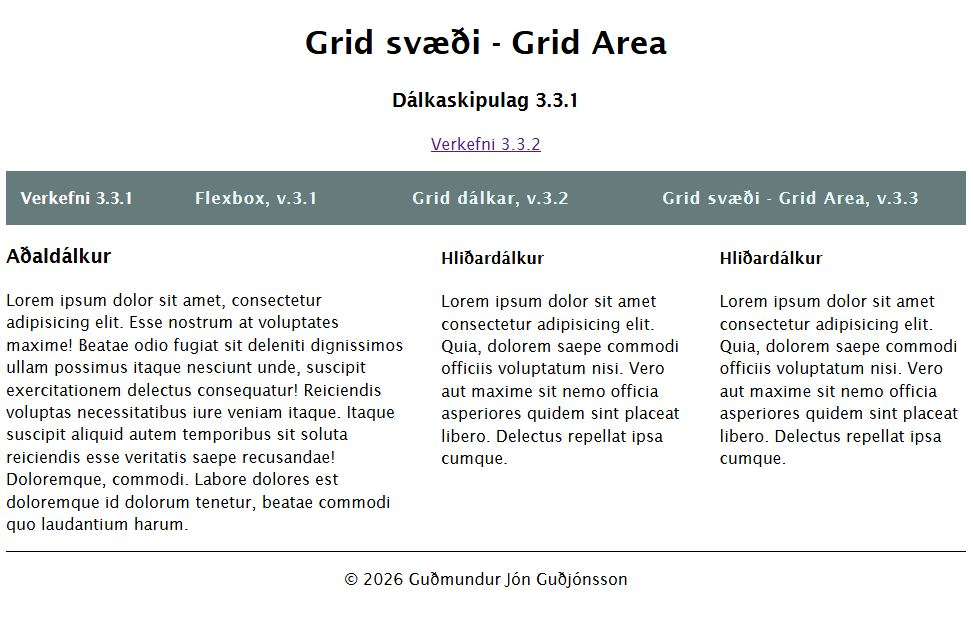
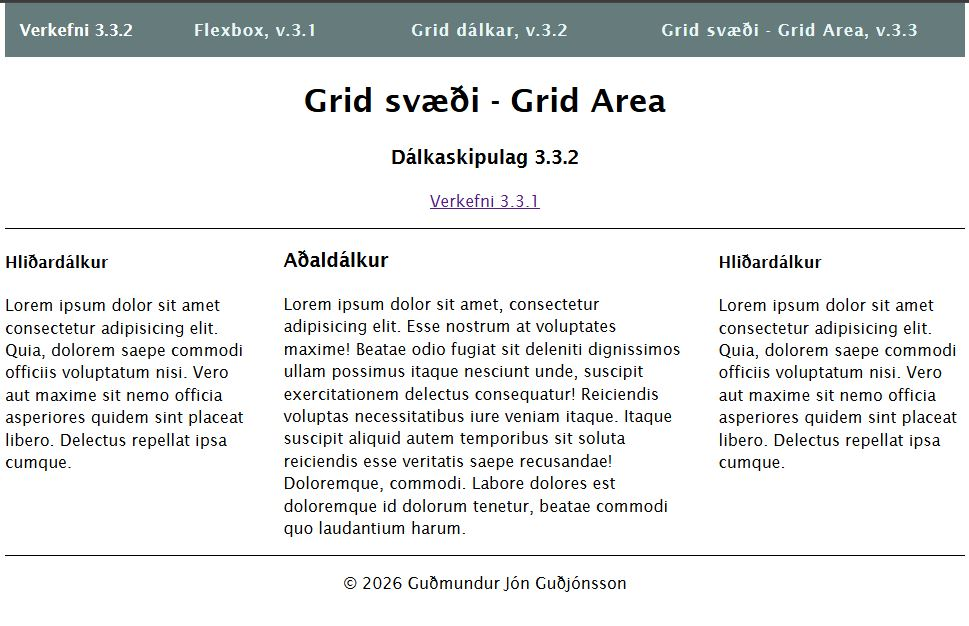

# Grid skipulagsdæmi

### Verkefni 3.2

Verkefni 3.2.1. **fr** _fraction_ einingin virkar eins og **%**  

Verkefni 3.2.2. Athugið að hér eru HtML tögin færð til þannig að aðaldálkurinn fái 3fr.

### Verkefni 3.3

Verkefni 3.3.1. Hér er uppsetning HTML tagana eins í báðum verkefnum.

Verkefni 3.3.2

