# Nýskráning Github reiknings

- [Nýskráning er á Github](https://github.com/signup?ref_cta=Sign+up&ref_loc=header+logged+out&ref_page=%2F&source=header-home)
- Til að stofna Github reikning verður þú að vera með tölvupóstfang (_E-mail account_). Þú getur notað skólapóstfang sem þér er úthlutað við innskráningu í Tækniskólann. [Hér eru leiðbeiningar á vef Tækniskólans um hvernig nemendur fá skólapóstfang](https://tskoli.is/nethjalp/um-skolanetfang/). Með því að nota skólapóstfangið getur þú fengið [Github Student Developer Pack](Namsefni-1/GithubStudentDeveloperPack.md) sem getur nýst þér vel í námi á tölvubraut.
- Einnig er hægt að stofna reikning með Google eða Apple reikningi

---

# Uppsetning vefsíðu á (notandi/username).github.io  

Github býður viðskiptavinum sínum að búa til vef sem tengist reikningi þeirra. Eina sem þarf að gera er að virkja veftenginguna í Github notendastillingum (Settings). 

dæmi:  
1.	Búðu til geymslu (_Repository_) með þínu notendanafni (_Username_)    
   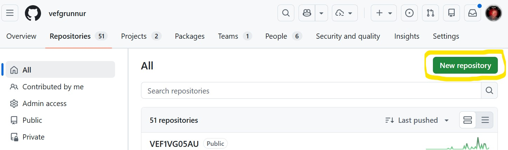
1.	nefndu geymluna með þínu **notendanafni**
   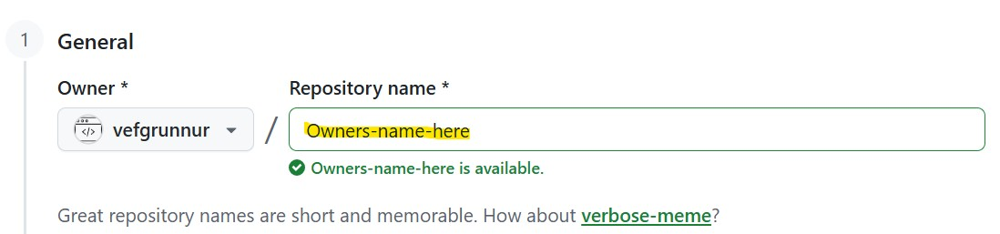
1. Hakaðu við **"Add README"** neðar á síðunni
   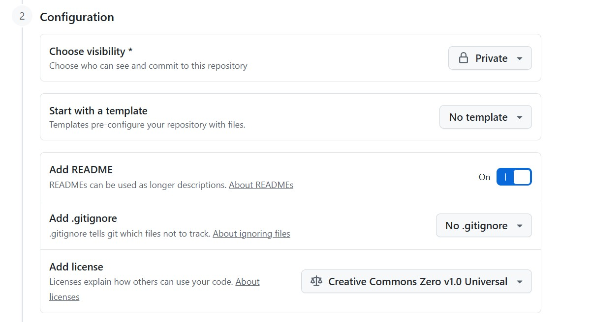
1. Neðst á síðunni þarf að stofna geymsluna með því að smella á **"Create Repository"**
   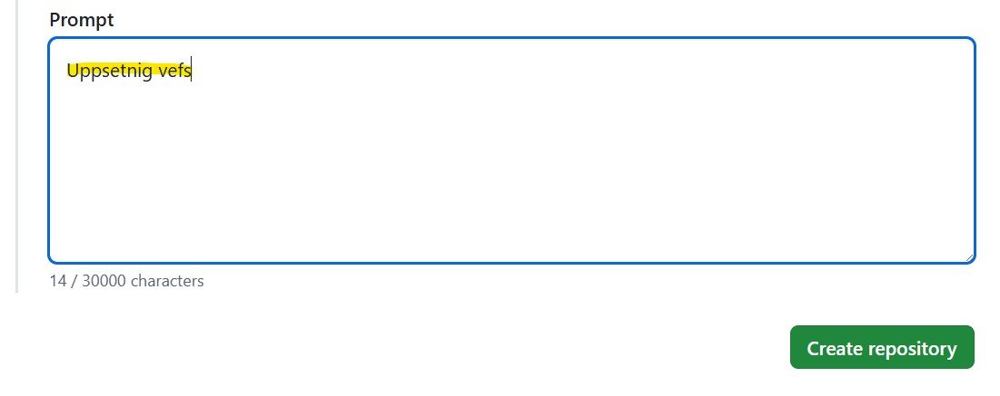
1. Þá ertu komin/n með geymslu þar sem hægt er að skila lokaverkefninu
   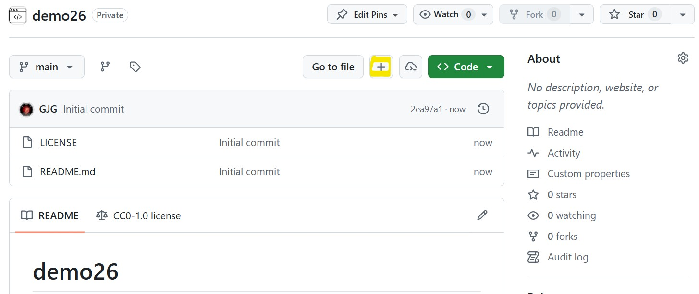
1. Til að hlaða inn efni vefsins þá smellir þú á [+] hnappinn og velur **"upload files**
   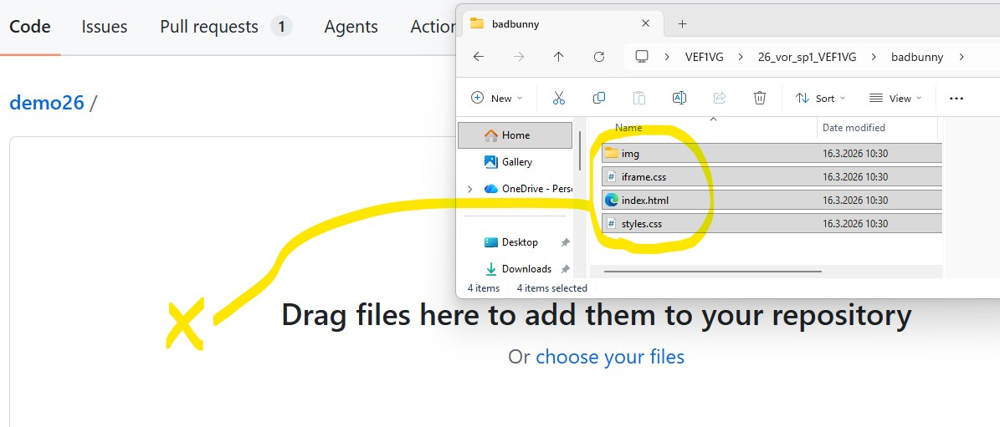
   Veldu allt efnið sem á að birta á vefnum sem er í verkefnamöppunni _en ekki möppuna sjálfa_
1. Neðst á síðunni þarf að senda gögnin með því að smella á **"Commit Changes"**
   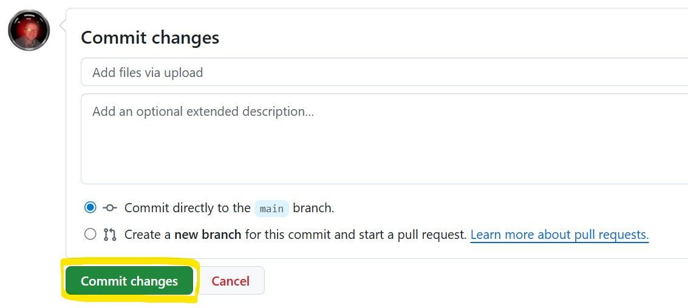
1. Þá er efni vefsins komið í geymsluna
   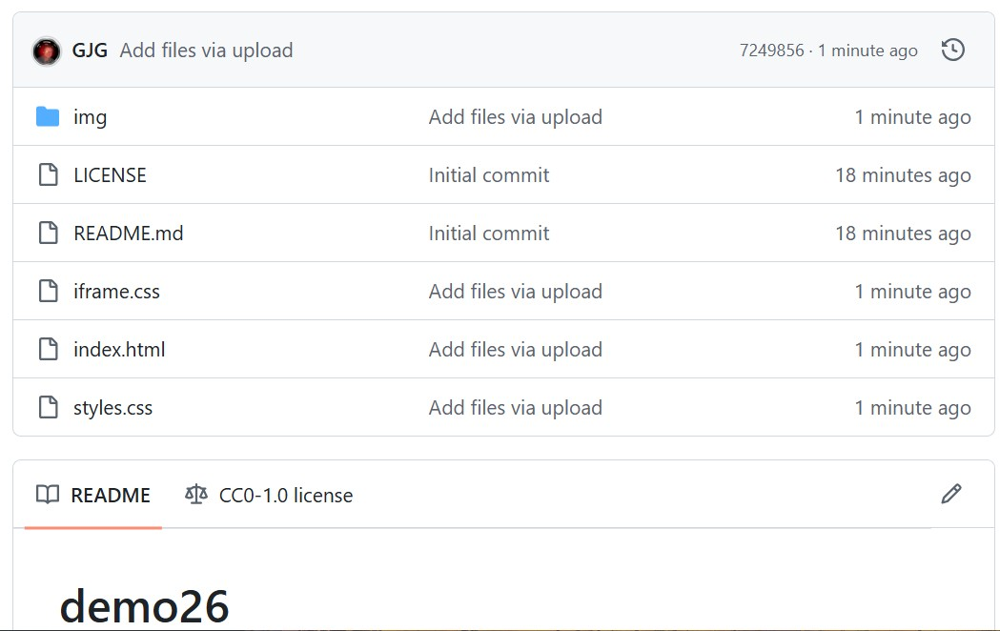

### Vefur birtur á internetinu

1.	Í notandi.github.io geymslunni -> valslá -> **Settings** -> **Pages**, þar velur þú `Branch`: **_Main_** og vistar (_save_) aðgerðina.
   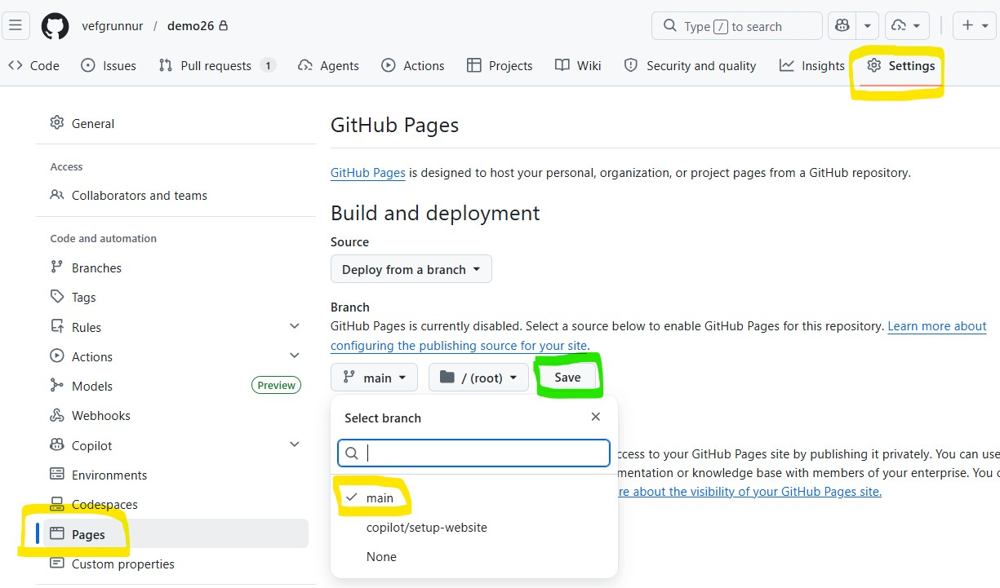
1.	Github býr til tengingu á milli geymslunnar og vefhýsingarinnar á github.io 
1.	Eftir skamma stund getur endurhlaðið (_reload_) umsjónarkerfið og birtist slóðin að vefnum þínum.
   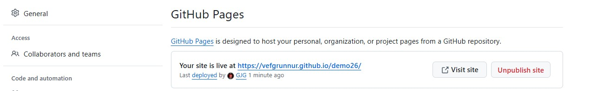

---

## Undirlén (_Subdomain_)

Ef við viljum búa til undirlén (_subdomain_) sem er með öðru skipulagi og útliti en er á _notandi.github.io_ þá er það tiltölulega einfalt mál. 

#### Dæmi

1. Stofnaðu geymslu og nefndu hana nafni verkefnisins sem þú ætlar að birta
    * Heiti geymslunnar má **ekki** vera með íslenskum stöfum eða með bil í nafninu
1. Notaðu sömu aðferð við að hlaða inn gögnum í geymsluna eins og sýnt er hér fyrir ofan.
   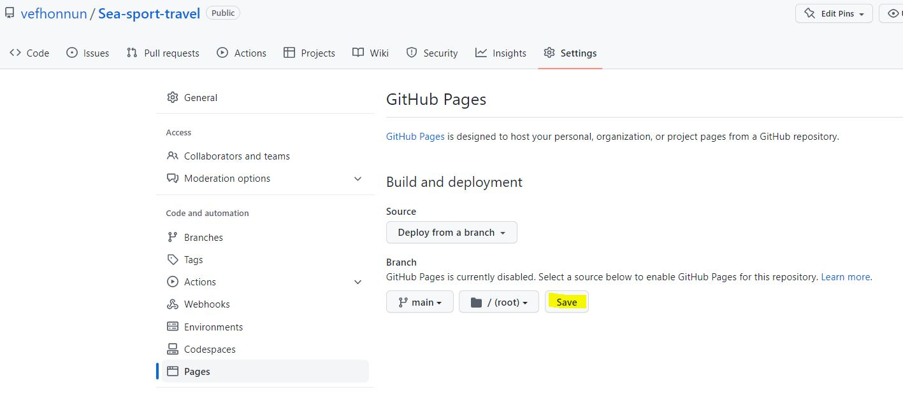
1. Eftir smá stund (2-3 mínútur) getur þú endurhlaðið (_refresh_)  Settings síðuna
    * 
1. smelltu á tengilinn og skoðaðu vefinn inn
    * 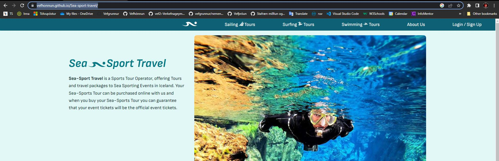


#### [Dæmi um undirlén](https://vefhonnun.github.io/sea-sport-travel/)


## Verkefnavinna með GIT

* Til að vinna með Git í Visual Studio Code þá þá verður að skrá Github notandanafnið þitt og tölvupóstfang í **Git bash** (PC) eða **_terminal_** (MAC). [$já nánar](https://vefgrunnur.github.io/verkefnaskil/git_innsetning.html) til að hægt sé að tengjast við Github  

```
git config --global user.name "þittnotendanafn"
git config --global user.email þitt@email.is

```
* Það er hægt að skrifa html í Github geymslunni en það eru þá smá breytingar.  
* Best er að afrita geymsluna yfir á þína tölvu, vinna verkefnin og skila síðan jafnóðum.  [Náðu í geymsluna yfir í þína tölvu](https://vefgrunnur.github.io/verkefnaskil/git_verklag.html)

```

Github.com/notendanafnið þitt (user account)
   |___ README.md
   |___ vef1vg (verkefnageymsla - repository)

       
Staðvært umhverfi (local environment) = tölvan þín.
   |___	vef1vg (verkefnageymsla - repository clone)

```
