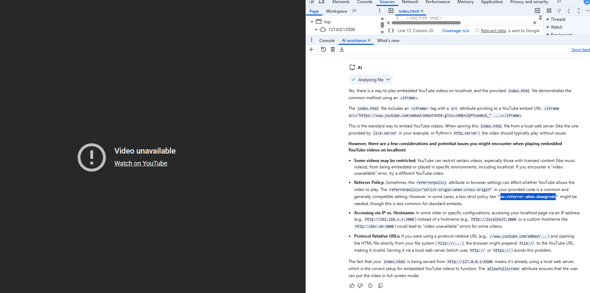

# Afhverju er ekki hægt að skoða Youtube video á localhost?

### Answer

Yes, there is a way to play embedded YouTube videos on localhost, and the provided `index.html` file demonstrates the common method using an `<iframe>`.

The `index.html` file includes an `<iframe>` tag with a `src` attribute pointing to a YouTube embed URL:
`<iframe src="https://www.youtube.com/embed/W9WUT4FD9-g?si=z90EnzQffyWW0cb_" ...></iframe>`

This is the standard way to embed YouTube videos. When serving this `index.html` file from a local web server (like the one provided by `live-server` in your example, or Python's `http.server`), the video should typically play without issues.

**However, there are a few considerations and potential issues you might encounter when playing embedded YouTube videos on localhost:**

*   **Some videos may be restricted:** YouTube can restrict certain videos, especially those with licensed content (like music videos), from being embedded or played in specific environments, including localhost. If you encounter a "video unavailable" error, try a different YouTube video.
*   **Referrer Policy:** Sometimes, the `referrerpolicy` attribute or browser settings can affect whether YouTube allows the video to play. The `referrerpolicy="strict-origin-when-cross-origin"` in your provided code is a common and generally compatible setting. However, in some cases, a less strict policy like `"no-referrer-when-downgrade"` might be needed, though this is less common for standard embeds.
*   **Accessing via IP vs. Hostname:** In some older or specific configurations, accessing your localhost page via an IP address (e.g., `http://192.168.x.x:3000`) instead of a hostname (e.g., `http://localhost:3000` or a custom hostname like `http://dev-vm:3000`) could lead to "video unavailable" errors for some videos.
*   **Protocol Relative URLs:** If you were using a protocol-relative URL (e.g., `//www.youtube.com/embed/...`) and opening the HTML file directly from your file system (`file:///...`), the browser might prepend `file://` to the YouTube URL, making it invalid. Serving it via a local web server (which uses `http://` or `https://`) avoids this problem.

The fact that your `index.html` is being served from `http://127.0.0.1:5500` means it's already using a local web server, which is the correct setup for embedded YouTube videos to function. The `allowfullscreen` attribute ensures that the user can put the video in full-screen mode.
   

